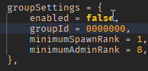

## Admin Setup

To set up admin privileges, follow these steps:

1. **Enable Group Settings**  
   Go to your **SpawnerSettings**, enable `groupSettings`, and enter your **groupID**.

2. **Adjust Minimum Admin Rank**  
   Set the `minimumAdminRank` according to your group ranks. This determines the lowest rank that will have admin access.

3. **Access the Admin Panel**  
   To open the admin panel, click on your **profile picture** in the spawner UI.

> **Important:** If you do not enable `groupSettings`, **everyone** will have admin privileges!

---

:::note
Still need support? Join our [Discord Server](https://discord.gg/5k85S4KWSR) for help!
:::
