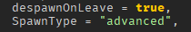
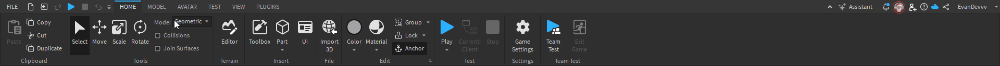

## What is Advanced Spawning?

Advanced spawning reduces lag in your game by using a single model for all buses of the same type. For example, all buses with the model `"2023 IC CE"` will only use one actual model, rather than 50 different models.

If you do not plan on using advanced spawning, you can delete the folder named `BusSpawns` in the **Workspace**.

---

## Setup

### 1. Set SpawnType to "Advanced"

First, go to your **SpawnerSettings** and set the `SpawnType` to `"advanced"`.

---

### 2. Set the Model Name Attribute

For all buses that will use the same model, set the `ModelName` attribute under your configurations to the name of the model you want (e.g., `"2023 IC CE"`).

---

### 3. Organize the BusSpawns Folder

Ensure that the **BusSpawns** folder is ungrouped and placed into **Workspace**. You can now move the arrow wherever you want it to go. The bus's pivot will determine the position of the arrow, so feel free to rotate and move it.

The front of the bus will face in the same direction as the arrow, as long as the bus's pivot is set up correctly. 

**Tip:** Duplicate and rename the arrow to match the bus number.

---

### 4. Repeat for Each Model

Repeat steps 2 and 3 for each bus model you have.

---

### 5. Issues with Pivot

If the bus is not pivoting correctly, all you have to do is reset the pivot on the bus model.

---

## Congratulations, You Have Set Up Advanced Spawning!

By following these steps, you should now have advanced spawning set up, which helps reduce lag and improves performance in your game.

:::note
Still need support? Join our [Discord Server](https://discord.gg/5k85S4KWSR) for help!.
:::