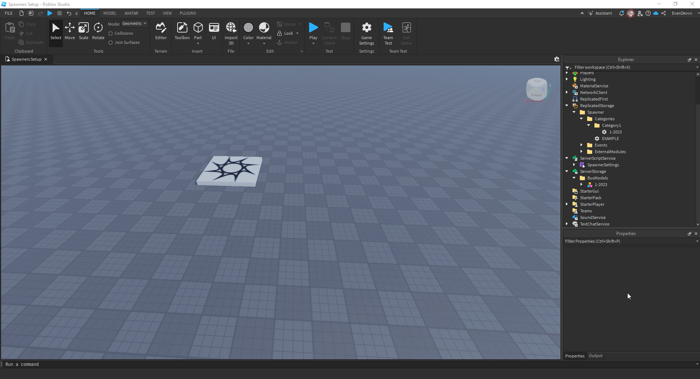

## Example Settings File

### General Structure

| Section                | Key/Field                  | Description                                                                                     | Type           | Example/Default Value               |
|------------------------|----------------------------|-------------------------------------------------------------------------------------------------|----------------|-------------------------------------|
| `theme`                | `title`                   | The title displayed on the spawner UI.                                                         | `String`       | `"GTS Assets Spawner"`             |
|                        | `logo`                    | The Asset ID of the logo displayed on the spawner UI.                                           | `Number`       | `13970392854`                      |
| `categories`           | `CategoryX.name`          | The name of the category.                                                                      | `String`       | `"Standard 1 Free"`                |
|                        | `CategoryX.categoryType`  | The type of category (`"free"`, `"gamepass"`, `"clothing"`, `"groupRank"`, or `"premium"`). | `String`       | `"free"`                           |
|                        | `CategoryX.assetId`       | The Asset ID required for access (if applicable).                                              | `Number`       | `000000`                           |
|                        | `CategoryX.layoutOrder`   | The order in which the category appears in the spawner.                                         | `Number`       | `1`                                |
| `groupSettings`        | `enabled`                 | Whether group restrictions are enabled.                                                        | `Boolean`      | `false`                            |
|                        | `groupId`                 | The Group ID required for access.                                                              | `Number`       | `3395411`                         |
|                        | `minimumSpawnRank`        | The minimum rank in the group allowed to spawn buses.                                           | `Number`       | `1`                                |
|                        | `minimumAdminRank`        | The minimum rank in the group with admin privileges.                                            | `Number`       | `255`                              |
| `webhookSettings`      | `enabled`                 | Whether webhook notifications are enabled.                                                     | `Boolean`      | `false`                            |
|                        | `workersURL`              | The URL of the webhook worker.                                                                 | `String`       | `"https://my-worker-url.workers.dev/"` |
| `CosmeticSettings`     | `gamepassLocked`          | Whether cosmetic settings are locked behind a Gamepass.                                         | `Boolean`      | `false`                            |
|                        | `gamepassId`              | The Gamepass ID for cosmetic settings (if applicable).                                          | `Number`       | `000000`                           |
| `modelsLocation`       | N/A                       | The location of the bus models in the hierarchy.                                               | `Instance`     | `game.ServerStorage.BusModels`     |
| `teleportToBus`        | N/A                       | Whether players teleport to the bus upon spawning it.                                          | `Boolean`      | `true`                             |
| `despawnOnLeave`       | N/A                       | Whether buses despawn when players leave the game.                                             | `Boolean`      | `true`                             |
| `SpawnType`            | N/A                       | The type of spawner used (`"basic"` or `"advanced"`).                                          | `String`       | `"basic"`                          |



---


### Config Example (As Lua Code)

```lua showLineNumbers title="SpawnerSettings"
local config = {

    theme = {
        title = "GTS Assets Spawner",
        logo = 13970392854,
    },

    categories = {
        Category1 = {
            name = "Standard 1 Free",
            categoryType = "free",
            layoutOrder = 1,
        },
        Category2 = {
            name = "Standard 2 Free",
            categoryType = "free",
            layoutOrder = 2,
        },
        Category3 = {
            name = "Standard 3 Paid",
            categoryType = "gamepass",
            gamepassId = 13600173502,
            layoutOrder = 3,
        },
        Category4 = {
            name = "Standard 4 Paid",
            categoryType = "gamepass",
            gamepassId = 13600173502,
            layoutOrder = 4,
        },
    },

    groupSettings = {
        enabled = false,
        groupId = 16838109,
        minimumSpawnRank = 1,
        minimumAdminRank = 8,
    },

    modelsLocation = game.ServerStorage.BusModels,
    teleportToBus = true,
    despawnOnLeave = true,
}

return config
```

:::note
Still need support? Join our [Discord Server](https://discord.gg/5k85S4KWSR) for help!.
:::