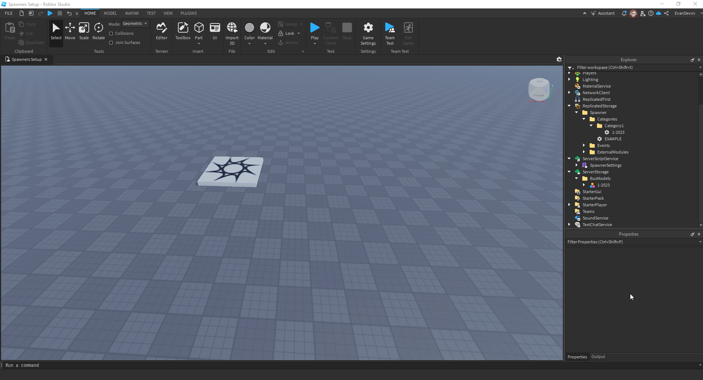

## Example Settings File

### General Structure

| Section                | Key/Field                  | Description                                                                                     | Type           | Example/Default Value               |
|------------------------|----------------------------|-------------------------------------------------------------------------------------------------|----------------|-------------------------------------|
| `theme`                | `title`                   | The title displayed on the spawner UI.                                                         | `String`       | `"GTS Assets Spawner"`             |
|                        | `logo`                    | The Asset ID of the logo displayed on the spawner UI.                                           | `Number`       | `13970392854`                      |
| `categories`           | `CategoryX.name`          | The name of the category.                                                                      | `String`       | `"Standard 1 Free"`                |
|                        | `CategoryX.categoryType`  | The type of category (`"free"`, `"gamepass"`, `"clothing"`, `"groupRank"`, or `"premium"`). | `String`       | `"free"`                           |
|                        | `CategoryX.assetId`       | The Asset ID required for access (applicable for `"gamepass"` or `"clothing"` categories).   | `Number`       | `13600173502`                      |
|                        | `CategoryX.groupRank`     | The group rank required for access (only for `"groupRank"` categories).                        | `Number`       | `255`                              |
|                        | `CategoryX.layoutOrder`   | The order in which the category appears in the spawner.                                         | `Number`       | `1`                                |
| `groupSettings`        | `enabled`                 | Whether group restrictions are enabled.                                                        | `Boolean`      | `false`                            |
|                        | `groupId`                 | The Group ID required for access.                                                              | `Number`       | `16838109`                         |
|                        | `minimumSpawnRank`        | The minimum rank in the group allowed to spawn buses.                                           | `Number`       | `1`                                |
| `modelsLocation`       | N/A                       | The location of the bus models in the hierarchy.                                               | `Instance`     | `game.ServerStorage.BusModels`     |
| `teleportToBus`        | N/A                       | Whether players teleport to the bus upon spawning it.                                          | `Boolean`      | `true`                             |
| `despawnOnLeave`       | N/A                       | Whether buses despawn when players leave the game.                                             | `Boolean`      | `true`                             |
| `TeleportType`         | N/A                       | Determines the teleportation method (`"seat"` or `"block"`).                                  | `String`       | `"block"`                         |



---

### Config Example (As Lua Code)

```lua showLineNumbers title="SpawnerSettings"
--!strict
local config = {

    theme = {
        title = "GTS Assets Spawner",
        logo = 13970392854,
    },

    categories = {
        Category1 = {
            name = "Standard",
            categoryType = "free",
            layoutOrder = 1,
        },
        Category2 = {
            name = "Gamepass Buses",
            categoryType = "gamepass",
            assetId = 13600173502,
            layoutOrder = 2,
        },
        Category3 = {
            name = "Group Buses",
            categoryType = "groupRank",
            groupRank = 255,
            layoutOrder = 3,
        },
        Category4 = {
            name = "Premium Locked Buses",
            categoryType = "premium",
            layoutOrder = 4,
        },
    },

    groupSettings = {
        enabled = false,
        groupId = 3395411,
        minimumSpawnRank = 1,
    },

    modelsLocation = game.ServerStorage.BusModels,
    teleportToBus = true,
    despawnOnLeave = true,
    TeleportType = "block",
}

return config
```

:::note
Still need support? Join our [Discord Server](https://discord.gg/5k85S4KWSR) for help!.
:::
