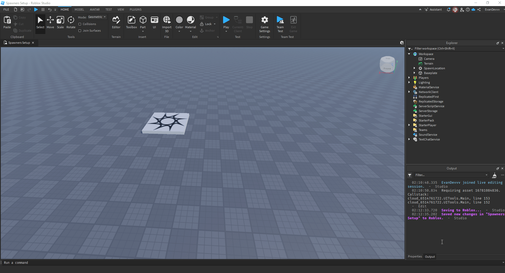

import ReactPlayer from 'react-player'

## Importing the `.RBXM` File

1. Right-click the **Workspace** in Roblox Studio.
2. Click **Insert from File** and select the `.RBXM` file.
3. Ungroup everything in the folder as prompted.

---

## Adding Buses to the Pro Spawner

This spawner supports basic spawning and advanced spawning, to see the differences and how to set advanced spawning up, head to Advanced Spawning on the side. If you don't want to use advanced spawning, just follow the instructions below.

### Steps to Add Buses

1. **Move the Bus Model:**
   - Duplicate the desired bus model.
   - Move it into the `Buses` folder within `ServerStorage`.
   - Rename the model to the bus number of your choice.

2. **Configure the Bus Category:**
   - Navigate to `ReplicatedStorage -> Spawner -> Categories`.
   - Select a category. If you haven't set up your categories yet, use `Category1`.
   - Copy the `EXAMPLE` configuration instance and paste it into your desired category.

3. **Rename and Edit Attributes:**
   - Rename the configuration instance to match your bus name.
   - Check and edit the **Attributes** in the **Properties** tab.

---

## How to Transfer from Huxley

<ReactPlayer url="https://www.youtube.com/watch?v=52kSKijLcL8" controls width="100%" height="360px" />

---

## Attributes Overview

Below is a table explaining the key attributes for bus configurations:

| Name           | Type       | Description                                                                                      |
|----------------|------------|--------------------------------------------------------------------------------------------------|
| `AssignedDriver` | `Number`   | The Roblox User ID of the player assigned to the bus.                                          |
| `Available`      | `BoolValue`| Indicates if the bus is available. Automatically managed; do not modify manually.              |
| `CurrentDriver`  | `String`   | Tracks the current driver of the bus. Automatically managed; do not modify manually.           |
| `Description`    | `String`   | Not currently used but will be added in a future update.                                       |
| `Image`          | `Number`   | The Asset ID of the image for the bus.                                                         |
| `ModelName`      | `String`   | The name of your bus model (e.g., `2025 IC CE`).                                               |
| `Servicing`      | `BoolValue`| Indicates if the bus is in service. If `false`, it will not appear in the spawner.             |
| `Spare`           | `BoolValue`   | Indicates if teh bus is a spare or not.                                                    |

---

:::note
Still need support? Join our [Discord Server](https://discord.gg/5k85S4KWSR) for help!.
:::