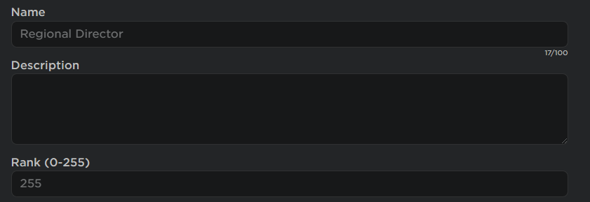

import ReactPlayer from 'react-player'

## Configuring Group ID, and Rank

1. If you want creating routes to be specifically locked to a group rank, open ```ServerScriptService -> RoutesHandler``` and at the top you will see the following:

| Name             | Type    | Description                                                                  |
|------------------|---------|------------------------------------------------------------------------------|
| GroupID          | Number  | This is the ID of your group.                                                |
| RMRank           | Number  | This is the RoleID of the Rank in the Group. If you need help finding this, please look at the image below. |
| GroupLockEnabled | Boolean | Set this to `true` if it is locked, or `false` if it's not.                   |

## Configuring Webhook

1. In the same script, a bit lower you will see the following:

| Name             | Type    | Description                                                                  |
|------------------|---------|------------------------------------------------------------------------------|
| webhookURL          | String  | This is the URL of the webhook, there is a more step that you `HAVE` to follow for this to work                                                |
| webhookEnabled           | Boolean  | Set this to true if the webhook is enabled, or false if it isn't. |
| webhookImage | String | This is an Image URL of an Image `UPLOADED in DISCORD, Not ROBLOX`                   |

2. The webhook URL needs to have a proxy, go to either one of these websites, paste in the webhook URL discord gave you, and copy the one that the website gives you back and put that instead.

https://hooks.hyra.io/
https://webhook.lewisakura.moe/


Role ID Image:
